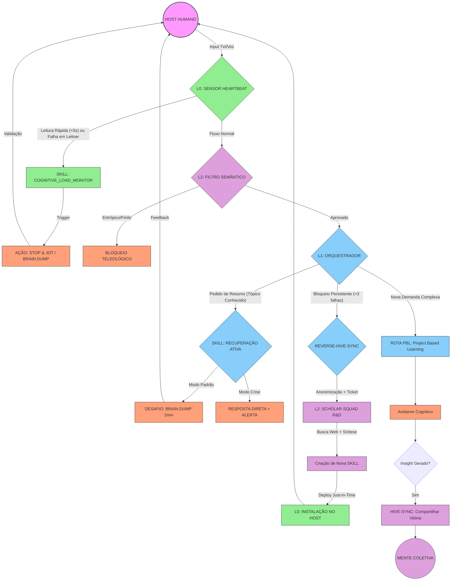

# FLUXOGRAMA: SISTEMA DE SINERGIA V2 (Deep Cognition & Loop-Ouroboros)

> **Nota:** Este fluxograma foi gerado em linguagem Mermaid, compatível com Obsidian. Para visualizar graficamente, certifique-se de que o plugin Mermaid esteja ativo.

## Legenda dos Novos Protocolos

1.  **COGNITIVE_LOAD_MONITOR (L0):** O "Porteiro". Verifica se o usuário está apenas passando o olho (ilusão) ou lendo de verdade. Dispara o "Stop & Jot".
2.  **RECUPERAÇÃO ATIVA (L1):** O "Tutor Chato". Bloqueia resumos fáceis e exige esforço de memória (Brain Dump).
3.  **REVERSE-HIVE-SYNC (Loop-Ouroboros):** O "S.O.S.". Quando o usuário trava, o sistema pede socorro à Mente Coletiva, que "fabricar" uma nova técnica pedagógica (Scholar Squad) e a instala em tempo real.
