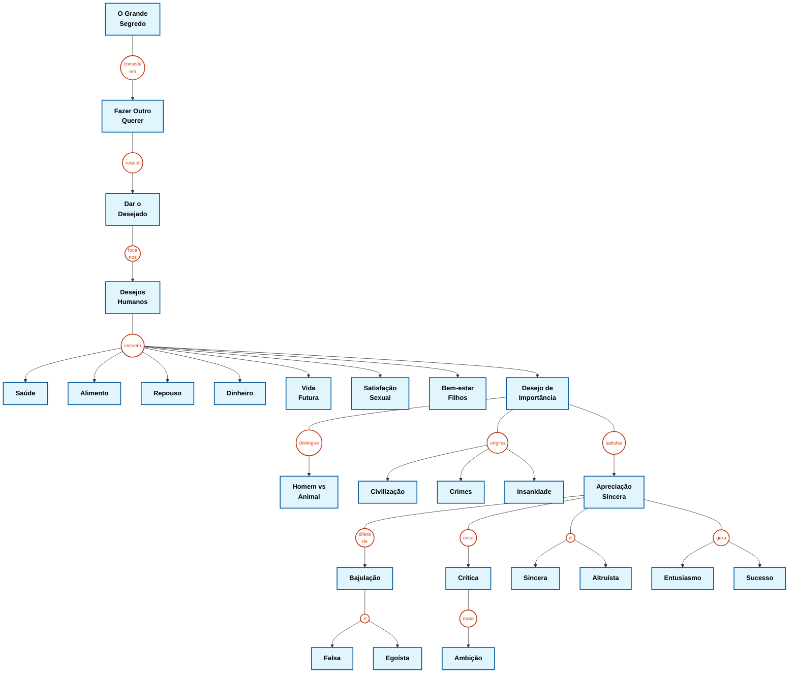

# Mapa Conceitual da Excelência (Norma SYNTROPY v3.0)

> [!IMPORTANT]
> **PERGUNTA FOCAL:** Qual o segredo para lidar com as pessoas?

---

---

> [!NOTE]
> **BIBLIOGRAFIA:**
> Carnegie, Dale. *Como fazer amigos e influenciar pessoas*. 52. ed. São Paulo: Companhia Editora Nacional, 2012.

---

## Relatório de Conformidade (Norma SYNTROPY v3.0)

1.  **Governança:** Pergunta Focal e Bibliografia isoladas fora do corpo do mapa.
2.  **Geometria Rígida:**
    *   **Conceitos:** Retângulos (`[]`) com wrapping aplicado (ex: `Fazer Outro Querer`, `Desejo de Importância`).
    *   **Verbos:** Círculos (`(())`) menores que os retângulos.
3.  **Topologia de Conexão:**
    *   **Conceito -> Verbo:** Linha sólida (`---`);
    *   **Verbo -> Conceito:** Seta direcionada (`-->`).
4.  **Anti-Entropia (LOG #012):**
    *   **Desejos Humanos:** Unificados no nó `((incluem))`.
    *   **Resultados da Importância:** Unificados no nó `((origina))`.
    *   **Qualidades:** Unificados nos nós `((é))`.
5.  **Compatibilidade:** Código Mermaid otimizado para renderização no Obsidian.
