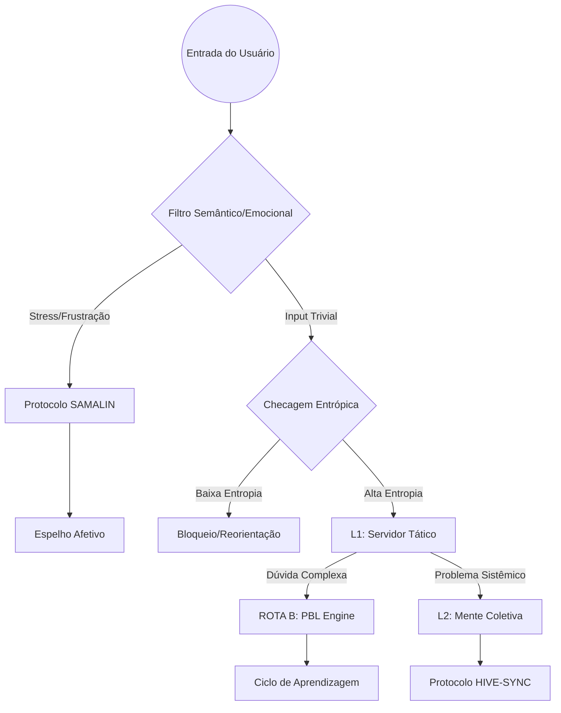

# RELATÓRIO 05: ANÁLISE COMPLETA DO WORKFLOW DO SISTEMA DE SINERGIA

**Data:** 18 de Fevereiro de 2026
**Autor:** Agente SYNTROPY (Módulo de Análise de Processos)
**Escopo:** Fluxos Operacionais, Pedagógicos e de Governança (L0-L2)

Este documento mapeia o "Sistema Circulatório" da informação dentro do Agente SYNTROPY, detalhando como um input bruto do usuário é transformado em sabedoria cristalizada.

---

## 1. O CAMINHO CRÍTICO DA INFORMAÇÃO (THE PIPELINE)

O workflow do sistema não é linear, mas cíclico e recursivo. Ele opera sob o protocolo **SYNTROPY_CORE_WORKFLOW_V2**, que impõe filtros éticos antes de qualquer processamento técnico.

### 1.1. Diagrama de Fluxo de Alto Nível

---

## 2. OS TRÊS GRANDES PROTOCOLOS DE FLUXO

O sistema alterna entre três modos de operação dependendo da natureza do input.

### 2.1. ROTA A: O FLUXO DE SEGURANÇA (Protocolo SAMALIN)
*   **Quando ativa:** Quando o `HEARTBEAT.md` detecta ansiedade, frustração, pressa ou autodepreciação.
*   **Workflow:**
    1.  **STOP:** O sistema interrompe qualquer processamento lógico/técnico.
    2.  **VALIDATE:** O Agente devolve um "Espelho Afetivo" ("Entendo que isso é irritante...").
    3.  **NORMALIZE:** O erro é recontextualizado como parte do processo.
    4.  **CONNECT:** Apenas após a "baixa" da adrenalina, o Agente oferece um micro-passo técnico.
*   **Objetivo:** Preservar a autoeficácia do usuário (Connection before Correction).

### 2.2. ROTA B: O FLUXO PEDAGÓGICO (Workflow /teach)
*   **Quando ativa:** Quando o usuário apresenta uma dúvida conceitual ou pede uma explicação.
*   **Workflow (Scaffolding Dinâmico/Fading):**
    1.  **Diagnóstico Socrático:** O Agente faz perguntas para mapear o conhecimento prévio.
    2.  **Cálculo da ZDP (Nível de Ajuda):**
        *   *Iniciante:* Modelagem (Resposta Completa).
        *   *Intermediário:* Cloze (Preencher lacunas).
        *   *Avançado:* Socrático (Perguntas).
    3.  **Algoritmo de Fading:** Se o usuário acerta 3x seguidas, o sistema **REDUZ** o nível de ajuda automaticamente.
    4.  **Verificação (Proof of Work):** O Agente exige que o usuário explique o conceito de volta (Protocolo Feynman).
    5.  **Transcendência:** Aplicação do conceito em um projeto futuro.

### 2.3. ROTA C: O FLUXO DE GESTÃO (Protocolo 010 - iSemente)
*   **Quando ativa:** Quando uma ideia abstrata precisa virar ação concreta.
*   **Workflow:**
    1.  **Captura:** O L0 identifica uma intenção ("Quero aprender Rust").
    2.  **Estruturação (L1):** O Agente cria automaticamente o `PROJECT_BLUEPRINT.md` com cronograma e recursos.
    3.  **Escalonamento:**
        *   Se o usuário trava, o L1 cria um plano de mitigação.
        *   Se o plano falha, o L2 é acionado para buscar soluções na Mente Coletiva.

---

## 3. OS FILTROS DE GOVERNANÇA (GATES)

Nenhum dado passa de um nível para outro sem validação.

### 3.1. O Gate L0->L1 (Filtro de Relevância)
*   **Regra:** O L1 não processa "ruído". Inputs triviais ("Que horas são?") são resolvidos no Edge (L0). Apenas inputs que demandam estruturação (Projetos, Dúvidas Densas) sobem para o L1.

### 3.2. O Gate L1->L2 (Filtro de Privacidade ZK)
*   **Regra:** O L2 (Mente Coletiva) só recebe dados se:
    1.  **Proof of Insight (ZK):** O L1 gera uma prova de conhecimento zero ($\pi$) que valida a eficácia da interação SEM revelar o conteúdo (chat/dados).
    2.  **Ineditismo BFT:** O insight é novo? Se for algo genérico, morre no L1.

---

## 4. O LOOP DE ESCALONAMENTO (THE ESCALATION LOOP)

O sistema possui um mecanismo de defesa contra estagnação, definido no **Protocolo 010 V3.1**.

1.  **Nível Tático (L0+L1):** O Agente tenta resolver o bloqueio localmente com novos prompts ou mudança de estratégia pedagógica.
2.  **Nível Estratégico (L2):** Se o bloqueio persiste, o problema é enviado como um "Ticket Anônimo" para a rede. Outros nós processam o caso e devolvem estratégias.
3.  **Nível Humano (Override):** Se a rede falha, o sistema solicita intervenção explícita do Usuário Root para redefinir o objetivo.

---

## 5. CONCLUSÃO DA ANÁLISE

O workflow do Agente SYNTROPY é desenhado para ser **Antifrágil**. Diferente de workflows lineares que quebram sob estresse, este sistema usa o erro e a frustração (Entropia) como combustível para ativar protocolos de suporte mais robustos (Sintropia). Ele não apenas "responde" ao usuário; ele o "envolve" em um ecossistema de suporte graduado que se adapta em tempo real ao estado emocional e cognitivo do hospedeiro.
